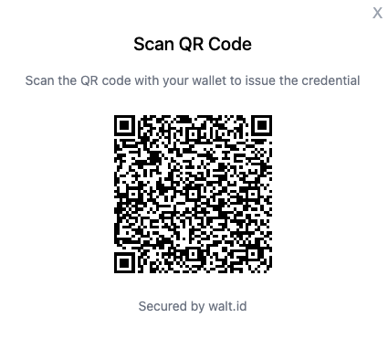
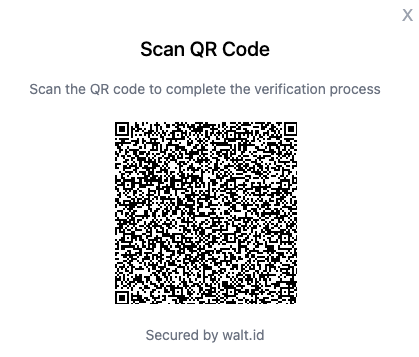

# walt.id JS SDK

Self-sovereign identity is awesome and we all know that. 😎

However, the process of issuing and verifying digital credentials can involve a number of steps, concepts and parameterisations that make the process less fun than it might have been when all you wanted to do was create a simple proof of concept or demo application.

To solve this problem, we created this project to provide users of the Walt.id identity stack with a set of ready-to-use Vue and React components that encapsulate the hassle of implementing basic SSI flows.

## What is it?

UI components for digital ID use-cases powered by [walt.id's Open-Source digital ID and wallet infrastructure](https://walt.id/identity-infrastructure).

## Main features

* Issue or verify digital ID credentials by rendering QR codes or links via pre-build model and button components.
* Configure credential types to issue or verify, provide redirect URIs for success events, and adjust the styling to your needs via component props. No need to understand and write complex issuance and verification requests or custom frontend components.
* A few minutes, and your ID use case is ready to present.
* The components offered are available for React and Vue.

## Disclosure

**Note:** At this point, the components are only meant for demo use-cases as secrets like private keys, used for signing credentials, are stored and handled in the frontend. Later versions will let you configure external credential storage options.

## How does it work?

In a nutshell, this is how to use it.

### 1. Install the lib

```bash
npm i waltid-react-components
```

### 2. Add the component to a page

```React
<IssuanceButton credentials={[{ "type": "eID" }]} />
```

### 3. Let the magic happen


To see it working straight away, take a look at [this example app](https://github.com/walt-id/waltid-js-sdk/tree/main/test-apps).

## Diving into the details

### Instalation

This library [is available in the NPM repository](https://www.npmjs.com/~waltid) in 2 flavours: [Vue](https://www.npmjs.com/package/waltid-vue-components) and [React](https://www.npmjs.com/package/waltid-react-components).

Installing the React version:

```bash
npm i waltid-react-components
```

Instaling the Vue version:

```bash
npm i waltid-vue-components
```

### Importing

Once the lib is installed on your environment, you can now start using it in your custom React or Vue components.

```
import { IssuanceButton, VerificationButton } from 'waltid-react-components'
```

### The components

The library provides two button components: the `IssuanceButton`, for credential issuance and the `VerificationButton`,  for credential verification.

Both are like black boxes that abstract all the necessary backend details for issuing and verifying credentials from the developer. If you are not sure about which details are hidden behind these buttons, take a look at [here](https://docs.walt.id/issuer/api/credential-issuance/vc-oid4vc) (for issuance) and [here](https://docs.walt.id/verifier/api/credential-verification/vc-oid4vc) (for verification).

#### Issuance

The only parameter you need to specify to create the credential issue button is the credential type. A list of the supported credential types in Walt.id is available in our [credential repository](https://credentials.walt.id/).

In the example below, we create a button to issue a [credential of type `eID`](https://credentials.walt.id/credentials/eid).

```react
<IssuanceButton credentials={[{ "type": "eID" }]} />
```

The result will be a button like this:


When clicked, the generated button will call the Issuer API to initialize an OID4VC exchange session. The final result will be a credential offer URL which will be enconded as a QrCode to be sacanned by the user with her wallet.



#### Verification

The basic usage of the verification button is very similar to the previous one. The only required parameter is the credential type to be presented.

```React
<VerificationButton credentialTypes={["eID"]} />
```

The resulting button will be like:


When clicked, the Verifier API will be called to initialize an OID4VP presentation session. Similiar to the issuance process, the result of the API call is a presentation request URL which is usually encoded as a QrCode.



The user then uses their wallet to scan the QrCode and the flow of credential presentation and verification continues.

### Customization

Both components offer a range of options to customize its appearance and behavior:

#### IssuanceButton

* credentials - A list of credential types. e.g.
  ```
  <IssuanceButton credentials={[{ "type": "eID" }, { "type": "OpenBadgeCredential" }]}/>
  ```
* title - The label in the button.
  ```
  <IssuanceButton credentials={[{ "type": "eID" }]} title="Get Credential"/>
  ```
* format - ??? Explain and give examples
  ```

  ```
* walletRedirect - ??? Explain and give examples
  ```

  ```
* buttonStyles - Set button styles.
  ```
  <IssuanceButton
            credentials={[{ "type": "eID" }]}
            buttonStyles={{ "background" : "#42f55d",
                            "color" : "#fb0000"
                         }}

  !!!! I couldn't make the other options work !!!!

  />
  ```


#### VerificationButton

* title - The label in the button.
  ```

  ```
* credentialTypes: Array<string | { credential: string, policies: Array<string | object> }>;
  ```

  ```
* globalVPPolicies: Array<string>,
  ```

  ```
* globalVCPolicies: Array<string>,
  ```

  ```
* presentationDefinition: object,
  ```

  ```
* options: { vpSuccessWalletRedirectUri?: string, vpFailWalletRedirectUri?: string, openId4VPProfile?: string },
  ```

  ```
* redirectUri: string,
  ```

  ```
* walletRedirect: { url?: string, path?: string, oidcUrl?: string, target?: string },
  ```

  ```
* buttonStyles - Button styling.
  ```

  ```

## Need more?

For more fine-grained customization, the components expose the walt.id's complete [issuer](https://docs.walt.id/issuer/api/getting-started) and [verifier](https://docs.walt.id/verifier/api/getting-started) API interfaces to be able to handle even the most complex use cases.

## For Maintainers

The SDK is built using Mitosis, a tool that allows you to build components in a framework-agnostic way.
Any extension of the components therefore must happen in the Mitosis language. You can learn more about it here.

### Project Structure

- [library](./library/): Mitosis project that contains the source code of the Waltid JS SDK.
    - [library/src](./library/src/): source code of the Waltid JS SDK.
    - [library/packages](./library/packages/): output of the Waltid JS SDK for different frontend frameworks.
- [test-apps](./test-apps/): test applications that demonstrate how to use the Waltid JS SDK with different frontend
  frameworks.

### When Developing

1. Run Mitosis in watch mode

```bash
npm install
cd library
npm run start
```

2. Build the library for the frontend framework you want to use. For example, to build the library for React:

```bash
cd library/packages/react
npm run build
```

3. Finally, run the test application. For example, to run the test application built with React:

```bash
cd test-apps/react
npm run dev
```
